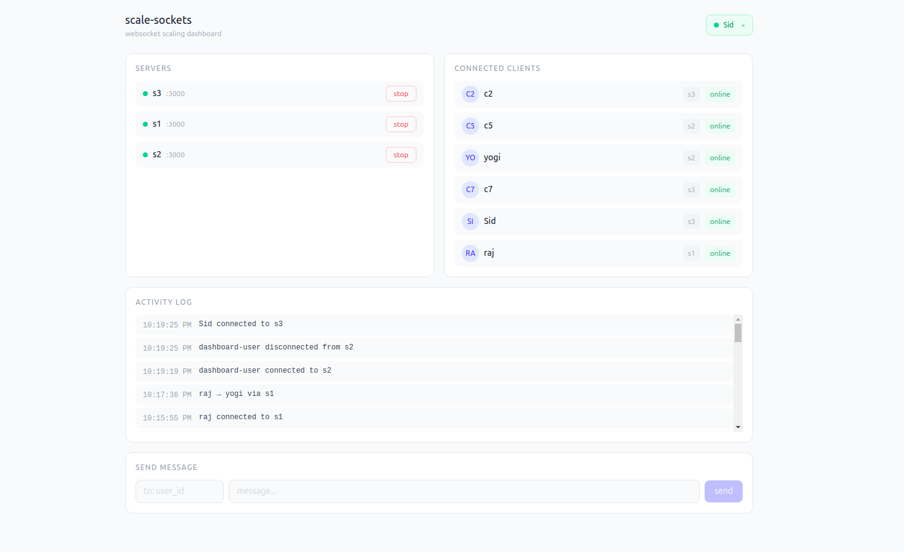
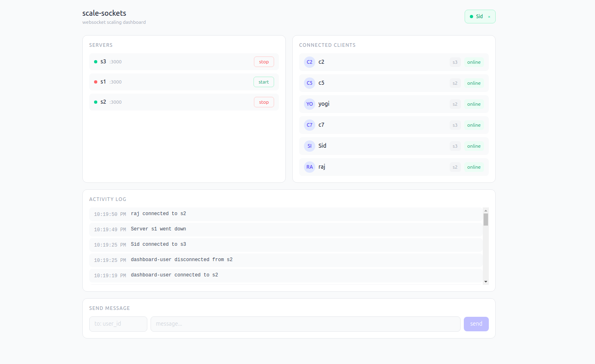
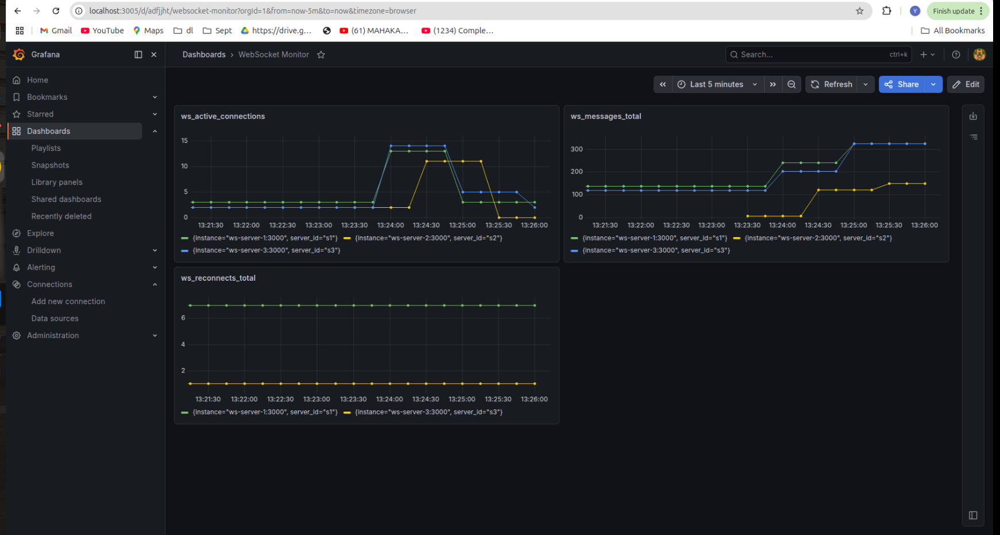
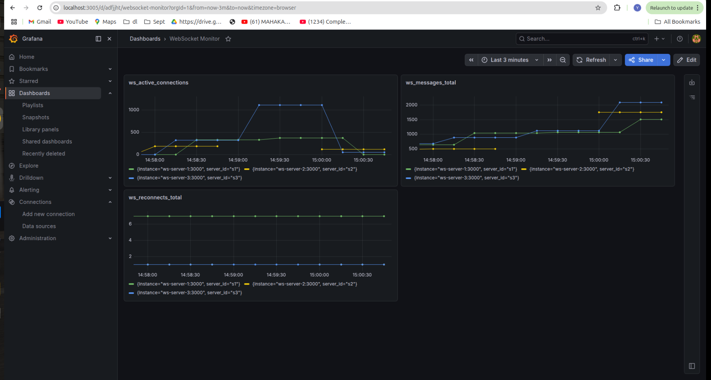

# Scale Sockets - WebSocket Scaling Simulator

A production-inspired demonstration of how real-time WebSocket applications scale horizontally across multiple server instances — with live failure simulation and cross-server messaging via Redis Pub/Sub.


**Live Demo:** http://3.86.9.144:8080/
---

## The Problem

In a single-server setup, real-time messaging is straightforward — every connected client is reachable directly. However, once the application is deployed across multiple instances (for scalability or reliability), users connected to **different servers cannot communicate directly**.

This project solves that problem using **Redis Pub/Sub as a message broker** between servers, ensuring any client can message any other client regardless of which server they're connected to. It also demonstrates **server failure scenarios** — stopping a server instance mid-session and watching traffic automatically reroute.


**Solution:** Redis Pub/Sub as a message broker + Nginx load balancing + multiple WebSocket server instances + containerized architecture.

---

## Frontend Dashboard

A lightweight dashboard is included to observe the system in real time.

It provides:

- **Servers View**  
  Displays all server instances with their status (up/down) and allows starting or stopping them.

- **Connected Clients**  
  Shows active clients and the server handling each connection.

- **Activity Log**  
  Real-time stream of events such as connections, disconnections, server lifecycle, and message routing.

- **Messaging Interface**  
  Send messages between clients and observe delivery across different server instances.

The dashboard acts as a visual layer to understand how load balancing and Redis-based message propagation behave under different conditions.


---

## Screenshot :  Local Frontend & Grafana Dashboard

<!--  -->
<p align="center">
  
  
</p>
<p align="center">
  
  
</p>

---

## Architecture


```
        Client (Browser / API)
                 │
                 ▼
        ┌──────────────────┐
        │      NGINX       │
        │  Load Balancer   │
        └────────┬─────────┘
                 │
      ┌──────────┼────────────┐
      ▼          ▼            ▼
 ┌────────┐  ┌────────┐  ┌────────┐
 │Server 1│  │Server 2│  │Server 3│
 │Clients │  │Clients │  │Clients │
 └────┬───┘  └────┬───┘  └────┬───┘
      │           │           │
      └───────────┼───────────┘
                  ▼
        ┌──────────────────┐
        │      Redis       │
        │    Pub / Sub     │
        └──────────────────┘
```


---

**Cross-server message flow:**

```
C1 (on WS-1) → message to C3 (on WS-3)
WS-1 publishes to Redis channel "user_messages"
WS-2, WS-3 receive the message
WS-3 finds C3 locally → delivers ✅
```

---

## Load Test Results

| Connections | Active Peak | Response p95 | CPU Usage | Failures |
| ----------- | ----------- | ------------ | --------- | -------- |
| 540         | Sustained   | 3.2ms        | 45%       | 0%       |
| 990         | Sustained   | 0.9ms        | 50%       | 0%       |
| 5,007       | ~1,000      | 5.9ms        | 125%      | 15%      |

**Key Findings:**

* Handles **1000+ concurrent connections** efficiently
* Sub-millisecond latency under normal load
* System saturates beyond 1000 active connections
* Automatic failover when instances crash

**Tested with:** Artillery load testing tool

---

## Key Concepts Demonstrated

* **Horizontal scaling** of stateful WebSocket servers
* **Redis Pub/Sub** for cross-process event propagation
* **Load balancing** with NGINX using `least_conn` strategy
* **Service registry** pattern — servers self-register on startup
* **Failure recovery** — traffic reroutes automatically when a node goes down
* **Production-ready monitoring** with Prometheus and Grafana

---

**Built for scale** | [Yogendra Raj](https://github.com/yogendraraj02)
